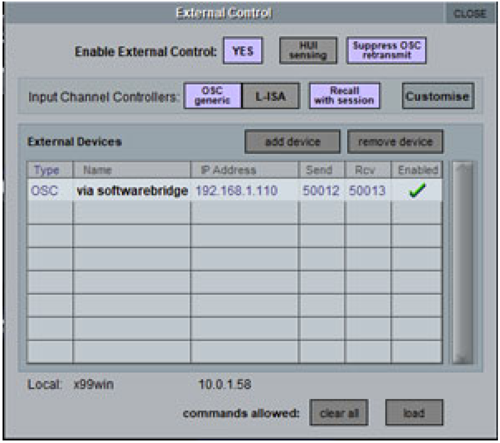

# d&b Soundscape control with DiGiCo SD Consoles - Generic OSC 

Copyright (C) 2017-2021, d&b audiotechnik GmbH & Co. KG

By downloading software from this site, you agree to the terms and conditions described in the [End-User License Agreement](EULA.md). If you do not agree with such terms and conditions do not download the software.

## Latest binaries can be downloaded here: [LATEST RELEASE](../../releases/latest)

---

<a name="toc" />

## Table of contents

* [Introduction](#introduction)
* [Features](#features)
* [Requirements](#requirements)
* [Setting up Generic OSC for d&b Soundscape (stand alone)](#setupDigico)
* [Enabling bidirectional communication for Generic OSC for Soundscape using the d&b Software bridge](#setupDigicoWithPollingBridge)
* [Additional functions](#additionalFunctions)
* [Known issues](#knownIssues)

<a name="introduction" />

## Introduction

d&b Soundscape integration for DiGiCo consoles can be realized with the DiGiCo Generic OSC feature and the d&b Software bridge.

A detailed description of the d&b Soundscape system, anddocumentation of the functions, features and configuration options are given in the "TI 501d&b Soundscape, System design and operation" which is available for download from the d&b website at www.dbaudio.com.

The DiGiCo Generic OSC feature enables DiGiCo SD consoles to remote control other devices via OSC from a control panel added to each input channel on the console surface.

This feature of the DiGiCo consoles in itself can be used to control d&b Soundscape parameters in the DS100 from the console surface.

In addition, d&b provides the free software tool “RemoteProtocolbridge” for MacOS and Windows which enables bidirectional communication and adjusts the parameter values between consoles and the DS100 in both directions. This ensures that the console always displays the actual status of the DS100, even if parameterson the DS100 have been changed by other tools, such as the d&b R1 Remote control software. This is possible since the Software bridge transfers all parameter changes directly to the console surface.

All this enables a basic integration of d&b Soundscape into the DiGiCo console user interface. As a result, the object-based functions of d&b Soundscape are added to the DiGiCo workflow, from object control in the channel strip up to the scene memory of the consoles.

More information about the Generic OSC feature is provided on the website or from the DiGiCo Support team.

For more info about the d&b Soundscape system and concept, please visit:
www.dbaudio.com and www.dbsoundscape.com.

<a name="features" />

## Features 

### Generic OSC functionality with d&b Soundscape
Control of the following d&b Soundscape parameters of the desired sound objects via the the console's channel strips 01-64.

To handle these parameters, they can also be stored and recalled using the scene memory of the console.

### En-Scene object parameters:
* X position (absolute or relative to a coordinate mapping)
* Y position (absolute or relative to a coordinate mapping)
* SPREAD
* Delay mode

### En-Space object parameters:
* Reverb send level

### Generic OSC functionality extended with the d&b Software bridge for d&b Soundscape
The d&b Software bridge extends the Generic OSC Soundscape integration with bidirectional communication between the DS100 and the console.

The d&b Software bridge constantly polls the values of the parameters described above from the DS100 and sends them back to the DiGiCo Console. This means, the console status is constantly updated even if changes have been made to these object parameters using other controllers like R1, a show control system, touchscreen-devices, or similar.

As a result, a flexible workflow is maintained even in complex setups.

<a name="requirements" />

## Requirements

* Any DiGiCo SD Console with Generic OSC enabled.
* d&b DS100 Signal Engine with active En-Scene and / or En-Space license.
* Console and DS100 Signal Engine connected to the same Ethernet network (to establish OSC communication).
* For bidirectional communication / workflow: Win or macOS PC running the d&b Software bridge. The PC must be connected to the same network. On Windows OS, the d&b Software bridge “RemoteProtocolbridge” requires installing the Visual C++ Redistributable Packages from Microsoft

### Helpful / necessary documents: 
OSC documentation of the DS100 which is available for download from the related DS100 product page at www.dbaudio.com.

<a name="setupDigico" />

## Setting up Generic OSC for d&b Soundscape (stand alone)

### Set up Generic OSC and connect with DS100:
* On the Master screen, select “Setup” and go to “External Control”.

### Switch on Generic OSC and select the correct mode for d&b Soundscape control
* Switch Enable External Control to “YES”.
* Switch Input Channel Controllers to “OSC-generic”.
* Switch on “Suppress OSC retransmit” & “Recall with session” if desired …

### Enter the parameters to establish the connection with the DS100:
Ensure the DS100 is connected to the same Ethernet network as your Console and their IP addresses and subnet masks are compatible.
Tap the “add device” button and select “other OSC” from the drop-down list. Enter the values to establish the connection: 
* Enter a name of your choice.
* Enter the IP address of the DS100. The IP address of the DS100 can be obtained from the «Info» tab in the «Device» view in R1 V3.
* Enter the Send port (this is the listening port of the DS100 = 50010).
* Enter the Receive port of the DS100 (this is the reply port of the DS100 = 50011).
* Press the “OK”/ return key.
* Click the red cross in the Enabled column to the right of your entries (a green check mark will appear instead).

 

### Assign the OSC commands to the rotaries and switches of the External Control window according to how they should control the d&b Soundscape parameters:
* Click the ”Costumise” button to display an assignment list for 8 rotaries.
* Assign the parameters of En-Scene and En-Space to the rotaries by entering the OSC commands and values in the OSC column.

The above entries result in the following assignment in the External Control window:

### Comments:
**Asterix sign:** the /* at the end of the OSC string is replaced by the channel number and refers to the DS100 input channel with the same number. Referring to a channel number which is different from the console’s input channel is not possible (console channel 1 always controls DS100 input channel 1 and console channel 2 controls DS100 input channel 2, etc...).

**Positioning:** It seems useful to use coordinate mapping. The positioning is mapped to one of the areas created in ArrayCalc and configured in R1. The digit before /* defines the targeted area. The value can be 1-4 according to which of the 4 positioning areas/coordinate mappings is targeted. Referring to different positioning areas for a single input channel is not possible.

**DelayMode:** The three available delay modes of En-Scene correspond to the integer values 0-2. Generic OSC sends float values but these can be interpreted by the DS100 and translated accordingly.

It is also possible to control other DS100 parameters with GenericOSC. In this document, we have restricted ourselves to the relevant Soundscape object parameters. 
The OSC strings for the control of further parameters can be found in the OSC documentation of the DS100.

### Enabling the External Control window for a channel strip of the console:
#### Channel surface:
* Open the Channel Out window by clicking the bottom section of the channel strip.
* Switch on External Control and click View.

#### External Control window:
When the External Control window is displayed, the parameters can be changed using the hardware encoders.

<a name="setupDigicoWithPollingBridge" />

## Enabling bidirectional communication for Generic OSC for Soundscape using the d&b Software bridge:

### General:
The OSC protocol does not provide a function that automatically updates the parameter values of an external controller if they have been changed in the controlled device (e.g. by a third device).

For this kind of bidirectional communication, the controlling OSC device would have to query and update the parameter values actively and continuously (polling function via OSC). Unfortunately, polling is not possible with DiGiCo Generic OSC.

In order to allow bidirectional communication between DiGiCo consoles and the DS100, a software bridge enabling this functionality for the Soundscape object parameters is provided by d&b.

This provides a workflow in which d&b Soundscape can be operated by a console, the R1 Remote control software and other controllers simultaneously. And the console always "knows" and displays the current parameter state ofthe DS100.

### Different data-flow for bidirectional communication with the Software bridge:
When using the Software bridge for bidirectional communication with the console, it does not "speak" directly to the DS100, but to the PC running the Software bridge.

The Software bridge passes the communication from the console on to the DS100 and constantly queries the parameters in the DS100 and sends them to the console.

### Parameters to establish the connection of the Console with the Software bridge
Ensure the Console, the PC running the Software bridge and the DS100 are connected to the same Ethernet network and their IP addresses and subnet masks are compatible.
* Click the “add device” button, select “other OSC” from the drop-down list and enter the values to establish the connection:
* Enter a name of your choice.
* Enter the IP address of the PC.
* The IP address indicated in the network settings of the PC running the Software bridge.
* Enter the Send port of the software (do not use the same port as on the DS100).
* Enter the Receive port of the software (do not use the same port as on the DS100).
* Press the “OK”/ return key.
* Click the red cross in the Enabled column to the right of your entries (a green check mark will appear instead).

 ### Parameters to establish the connection of the Software bridge with the console and the DS100:
 Ensure the console, the PC running the Software bridge and the DS100 are connected to the same Ethernet network and their IP addresses and subnet masks are compatible.

### Connection with the DS100
**Role A** for the connection with the DS100: 
* Enter the IP address of the DS100 in the line edit. The IP address of the DS100 can be obtained from the «Info» tab in the «Device» view in R1 V3.
* Open the "OSC protocol configuration" communication settings window by clicking the "Configuration" button for Role A the protocol. 
* Enter the Listening port and the Remote port in the two fields field. (the Remote port is the listening port of the DS100 = 50010; the Listening port is the reply port of the DS100 = 50011)
* Enable the parameters you want to use by checking the "enable" checkbox to the right of the parameter description (this enables them for polling).
* Enter the channels you want to control by defining a range "1-16" or multiple channel numbers divided by commas "1, 2, 3, 7, 8, 9".
* For the x and y position parameters, define the coordinate mapping / positioning area by checking the corresp. boxes under "Mapping". This must be the same value you used for the
“/dbaudio1/coordinatemapping/source_position_x/ & /dbaudio1/coordinatemapping/source_position_y/“
for Generic OSC on the console.
* Finish the configuration of the connection with the DS100 by clicking the OK button in the General configuration window.

### Connection with the Console
**Role B** for the connection with the Console:
* Enter the IP address of the console in the line edit.
* Open the "OSC protocol configuration" communication settings window by clicking the "Configuration" button for the Role B protocol. 
* Enter the Listening port and the Receive port of the console two fileds.
* DO NOT enable any objects for polling by clicking the "enable" check mark.
* Finish the configuration of the connection with the Console by clicking the OK button in the General configuration window.

Assign the OSC commands to the rotaries and switches of the External Remote Window of Generic OSC on the Console in the same way as for operation without the Software bridge.

Please refer to Section 4 “Setting up Generic OSC for d&b Soundscape” of this document.

**Note:** The Software bridge can only handle the following d&b Soundscape object parameters:
* Position
* Spread
* DelayMode
* En-Space Send Gain.

Start the Software bridge by clicking the “Start Engine” button

<a name="additionalFunctions" />

## Additional functions

### Protocol Traffic Logging
The Software bridge can log and display the network traffic handled.

This function is intended to simplify error analysis.

**Note:** This function may require a lot of computer resources and lead to a high processor load on the PC.
At the same time, activating this function will lead to a considerable amount of accumulated data in a very short time.
For this reason, only use this function for troubleshooting not for normal operation since it will endanger the stability of your PC and the software.

* Open the General configuration window by clicking on the Global Configuaration button.
* Tick the checkbox next to Allow protocol logging window.
* After closing the General configuration window, a “Show Traffic Logging” button is available.
* Clicking the Show Traffic Logging button opens the Protocol Traffic Logging window.
* The dropdown in the lower left corner allows toggeling between a traffic plot and a message log.
* Clicking the "Close" button closes the window.

<a name="knownIssues" />

## Known issues

### Delay mode:
The three available delay modes of En-Scene correspond to the integer values 0-2.

Generic OSC sends and receives float values.

This means that when using the bridge for this parameter, the value of the console knob cannot be changed reliably. 

Possible workaround: If you can restrict yourself to two values for the delay mode, use a switch control instead of a rotary.