# **d&b Soundscape control with DiGiCo SD Consoles - Generic OSC**

Copyright (C) 2017-2021, d&b audiotechnik GmbH & Co. KG

By downloading software from this site, you agree to the terms and conditions described in the [End-User License Agreement](EULA.md). If you do not agree with such terms and conditions do not download the software.

## Latest binaries can be downloaded here: [LATEST RELEASE](../../releases/latest)

---

<a name="toc" />

## **Table of contents**

* [Introduction](#introduction)
* [Features](#features)
* [Requirements](#requirements)
* [Setting up d&b Soundscape channel control](#setupDigico)
* [Enabling bidirectional communication for d&b Soundscape channel control using the d&b Software bridge](#setupDigicoWithPollingBridge)
  * [Dual DS100 for 128 channels](#128chCascade)
  * [Dual DS100 parallel](#dualDS100parallel)
* [Additional functionality](#additionalFunctionality)

<a name="introduction" />

## **Introduction**

d&b Soundscape integration for DiGiCo consoles can be realized with the DiGiCo Generic OSC feature and the d&b Software bridge.

A detailed description of the d&b Soundscape system, anddocumentation of the functions, features and configuration options are given in the "TI 501d&b Soundscape, System design and operation" which is available for download from the d&b website at www.dbaudio.com.

The DiGiCo Generic OSC feature enables DiGiCo SD consoles to remote control other devices via OSC from a control panel added to each input channel on the console surface.

This feature of the DiGiCo consoles in itself can be used to control d&b Soundscape parameters in the DS100 from the console surface.

In addition, d&b provides the free software tool “RemoteProtocolBridge” for MacOS and Windows which enables bidirectional communication and adjusts the parameter values between consoles and the DS100 in both directions. This ensures that the console always displays the actual status of the DS100, even if parameters on the DS100 have been changed by other tools, such as the d&b R1 Remote control software. This is possible since the Software bridge transfers all parameter changes directly to the console surface.

All this enables a basic integration of d&b Soundscape into the DiGiCo console user interface. As a result, the object-based functions of d&b Soundscape are added to the DiGiCo workflow, from object control in the channel strip up to the scene memory of the consoles.

More information about the Generic OSC feature is provided on the website or from the DiGiCo Support team. www.digico.biz

For more info about the d&b Soundscape system and concept, please visit:
www.dbaudio.com and www.dbsoundscape.com.

<a name="features" />

## **Features**

### **Generic OSC functionality with d&b Soundscape**
Control of the following d&b Soundscape parameters of the desired sound objects via the the console's channel strips.

To handle these parameters, they can also be stored and recalled using the scene memory of the console.

### **En-Scene object parameters:**
* X position (absolute or relative to a coordinate mapping)
* Y position (absolute or relative to a coordinate mapping)
* SPREAD
* Delay mode

### **En-Space object parameters:**
* Reverb send level

### **Generic OSC functionality extended with the d&b Software bridge for d&b Soundscape**
The d&b Software bridge extends the Generic OSC Soundscape integration with bidirectional communication between the DS100 and the console.

The d&b Software bridge constantly polls the values of the parameters described above from the DS100 and sends them back to the DiGiCo Console. This means, the console status is constantly updated even if changes have been made to these object parameters using other controllers like R1, a show control system, touchscreen-devices, or similar.

As a result, a flexible workflow is maintained even in complex setups.

<a name="requirements" />

## **Requirements**

* Any DiGiCo SD Console with Generic OSC enabled.
* d&b DS100 Signal Engine with active En-Scene and / or En-Space license.
* Console and DS100 Signal Engine connected to the same Ethernet network (to establish OSC communication).
* For bidirectional communication / workflow: Win or macOS PC running the d&b Software bridge. The PC must be connected to the same network. On Windows OS, the d&b Software bridge “RemoteProtocolbridge” requires installing the Visual C++ Redistributable Packages from Microsoft

### **Helpful / necessary documents:**
OSC documentation of the DS100 which is available for download from the related DS100 product page at www.dbaudio.com.

<a name="setupDigico" />

## **Setting up d&b Soundscape channel control**

### **Set up Generic OSC and connect with DS100:**
* On the Master screen, select “Setup” and go to “External Control”.

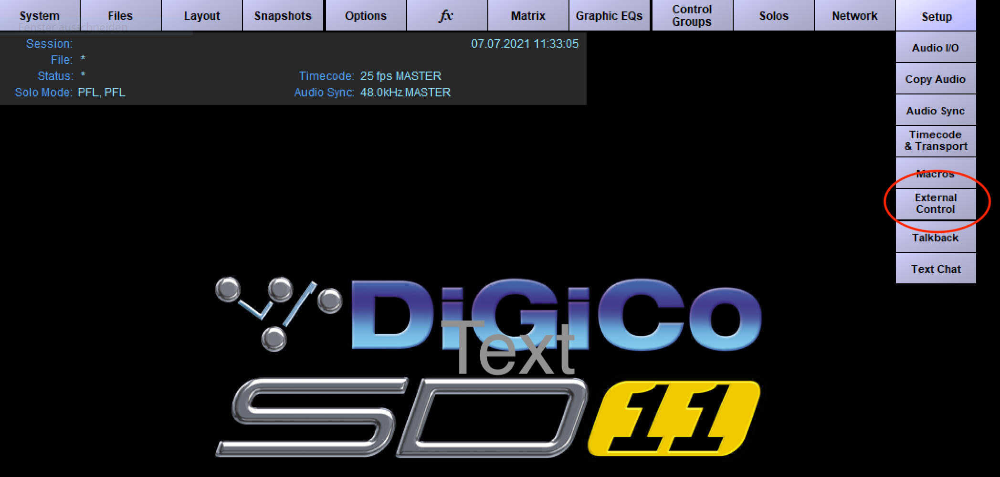

### **Switch on Generic OSC and select the correct mode for d&b Soundscape control**
* Switch Enable External Control to “YES”.
* Switch Input Channel Controllers to “OSC-generic”.
* Switch on “Suppress OSC retransmit” to not have the Console reply to every incoming OSC message 
* Switch on “Recall with session” if loading a session shall trigger sending all parameters as OSC messages initially

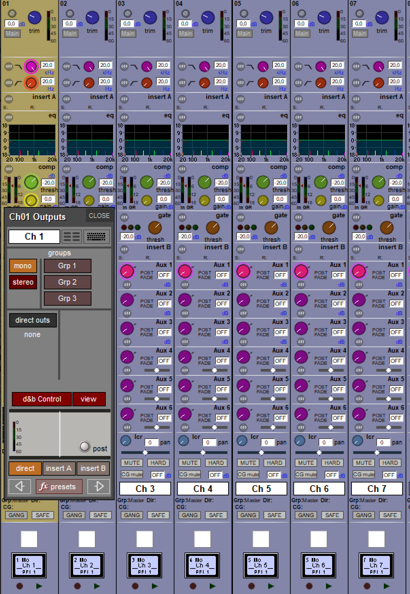

### **Enter the parameters to establish the connection with the DS100:**
Ensure the DS100 is connected to the same Ethernet network as your Console and their IP addresses and subnet masks are compatible.
Tap the “add device” button and select “other OSC” from the drop-down list. Enter the values to establish the connection: 
* Enter a name of your choice.
* Enter the IP address of the DS100. The IP address of the DS100 can be obtained from the «Info» tab in the «Device» view in R1 V3.
* Enter the Send port (this is the listening port of the DS100 = 50010).
* Enter the Receive port (this is the port that the DS100 replies to = 50011).
* Press the “OK”/ return key.
* Click the red cross in the Enabled column to the right of your entries (a green check mark will appear instead).

### **Enabling the External Control window for a channel strip of the console:**

#### **Channel surface:**
* Open the Channel Outputs window by clicking the bottom section of the channel strip.
* Switch on d&b Control and click View.
* Instead of regular lcr pan control, the d&b Soundscape two-dimensional panner is now visible in the channelstrip

#### **External Control window:**
* Right-click on the d&b Soundscape control in the channelstrip to bring up the d&b Soundscape window, containing from left to right:
  * Sound Object xy position
  * Sound Object x position rotary
  * Sound Object y position rotary
  * Sound Object Spread factor rotary
  * Sound Object EnSpace send gain rotary
  * Sound Object delay mode toggle buttons
* These values can be controlled by hardware knobs and buttons. The xy values can also be controlled through the console touchscreen.
* Right-click on the xy Sound Object position fader to open an enlarged version of the xy position fader combined with spread, delay mode and EnSpace send gain visualization
* Click on the Object Number button on the right side of the enlarged xy Sound Object position fader window to bring up the Object Number assignment window and choose the Sound Object number, the channelstrip shall control.
* Click on the Mapping button on the right side of the enlarged xy Sound Object position fader window to bring up the Mapping Area assignment window and choose the mapping area that shall be targeted by the d&b Soundscape control of the channelstrip.

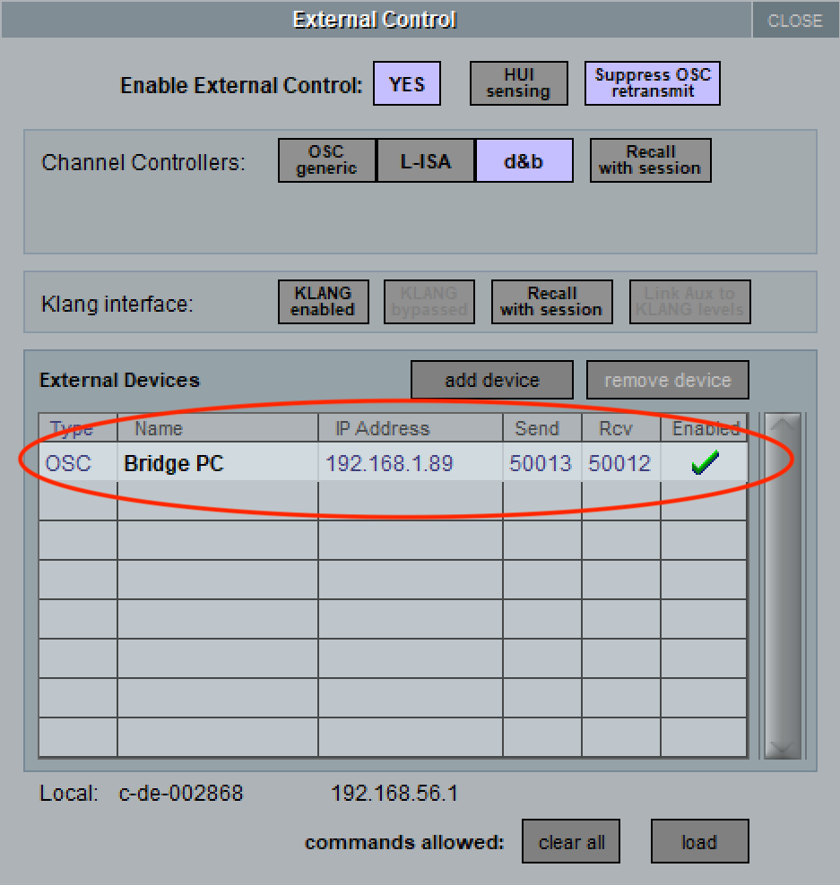

<a name="setupDigicoWithPollingBridge" />

## **Enabling bidirectional communication for d&b Soundscape channel control using the d&b Software bridge:**

### **General:**
The OSC protocol specification does not define how value changes in a controlled device are updated and kept in sync in the externall controller.

For this kind of bidirectional communication, the OSC controller has to read updated values from the controlled device actively at a sufficiently small refresh interval to provide this information e.g. on a software user interface (so called OSC 'polling' functionality). Polling updated device data is not available in DiGiCo d&b Soundscape control.

In order to allow bidirectional communication between DiGiCo consoles and the DS100, a software bridge enabling this functionality for the Soundscape object parameters is provided by d&b.

This provides a workflow in which d&b Soundscape can be operated by a console, the R1 Remote control software and other controllers simultaneously. And the console always "knows" and displays the current parameter state of the DS100.

### Different data-flow for bidirectional communication with the Software bridge:
When using the Software bridge for bidirectional communication with the console, the latter does not "speak" directly to the DS100, but to the PC running the Software bridge.

The Software bridge passes the OSC data traffic from the console on to the DS100 and constantly queries the parameters from the DS100 and sends them to the console.

### **Parameters to establish the connection of the Console with the Software bridge**
Ensure the Console, the PC running the Software bridge and the DS100 are connected to the same Ethernet network and their IP addresses and subnet masks are compatible.
* Click the “add device” button, select “other OSC” from the drop-down list and enter the values to establish the connection:
* Enter a name of your choice.
* Enter the IP address of the PC running the Software bridge.
* Enter the Send port to use for the connection to the Software bridge (do not use the same port as used by the DS100, e.g. 50013).
* Enter the Receive port to use for the connection to the Software bridge (do not use the same port as used by the DS100, e.g. 50012).
* Press the “OK”/ return key.
* Click the red cross in the Enabled column to the right of your entries (a green check mark will appear instead).

 ### **Parameters to establish the connection of the Software bridge with the console and the DS100:**
 Ensure the console, the PC running the Software bridge and the DS100 are connected to the same Ethernet network and their IP addresses and subnet masks are compatible.

### **Connection with the DS100**
**Role A** for the connection with the DS100: 
* Enter the IP address of the DS100 in the text field. The IP address of the DS100 can be obtained from the «Info» tab in the «Device» view in R1 V3.
* Open the "OSC protocol configuration" communication settings window by clicking the "Configuration" button for Role A the protocol. 
* Enter the Listening port and the Remote port in the two text fields. (the Remote port is the listening port of the DS100 = 50010; the Listening port is the reply port of the DS100 = 50011)
* Enable the following parameters by checking the "enable" checkbox to the right of the parameter description (this enables them for polling).
  * Sound Object Position X
  * Sound Object Position Y
  * Sound Object Spread
  * Sound Object Delay Mode
  * Sound Object Send Gain
* Enter the channels you want to control by defining a range "1-16" or multiple channel numbers divided by commas "1, 2, 3, 7, 8, 9".
* For the x and y position parameters, define the Mapping Areas to be used by checking the corresp. boxes under "Mapping". These must be all Mapping Areas you have used across all channelstrip configurations using d&b Soundscape control on the console.
* If desired, you can choose a polling interval different from the default 100ms.
* Finish the configuration of the connection with the DS100 by clicking the OK button in the General configuration window.

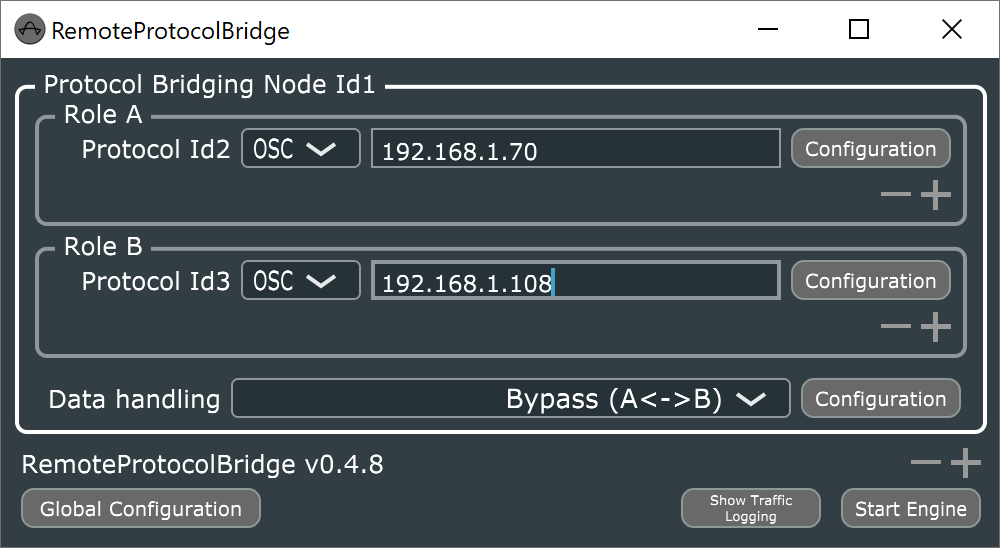
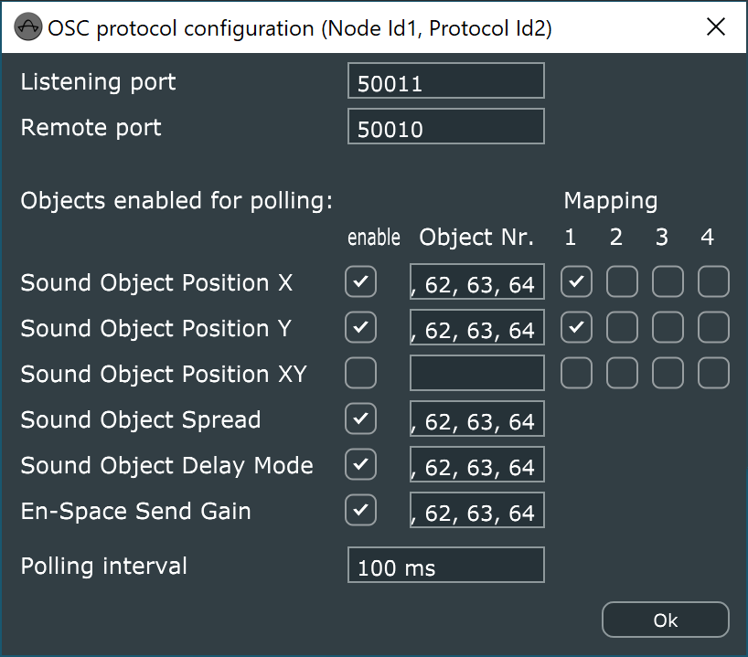

### **Connection with the Console**
**Role B** for the connection with the Console:
* Enter the IP address of the console in the text field.
* Open the "OSC protocol configuration" communication settings window by clicking the "Configuration" button for the Role B protocol. 
* Enter the Listening port and the Receive port as used when setting up the console (e.g. as suggested above 50013 and 50012).
* DO NOT enable any objects for polling by clicking the "enable" check mark.
* Finish the configuration of the connection with the Console by clicking the OK button in the General configuration window.

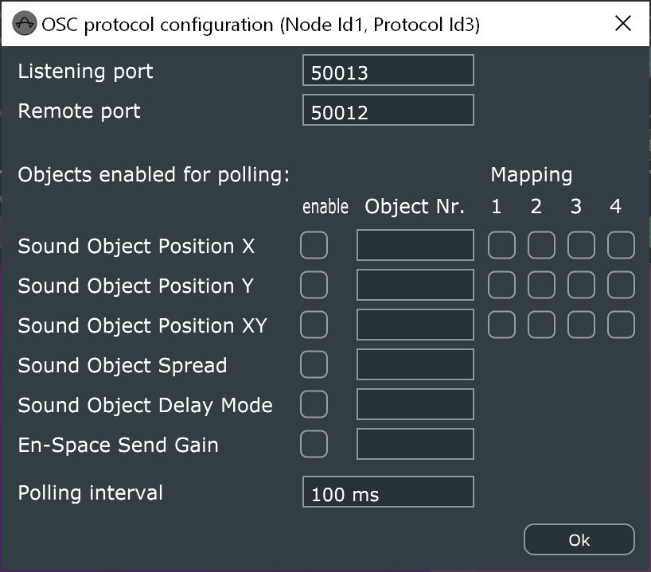

**Note:** The Software bridge can only handle the following d&b Soundscape object parameters:
* Position
* Spread
* DelayMode
* En-Space Send Gain.

### **Sound Object Data Handling**
* Select "Forward value changes only" from the Data handling dropdown to achive that all data that is received from DS100 through polling and that contains changed data values is forwarded to Console.
* Click the "Configuration" button for Data handling module and select "0.001" as sensibility for value change detection.

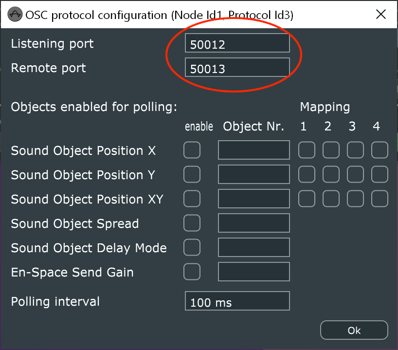
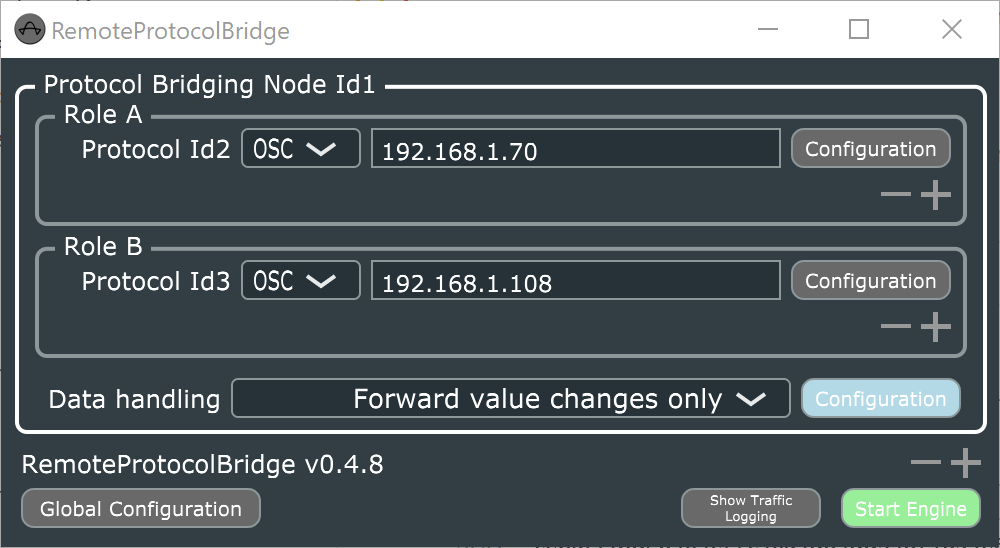

Start the Software bridge by clicking the “Start Engine” button

<a name="128chCascade" />

### **Using 128 console channels to control two DS100**
By choosing the Data handling "Multiplex multiple n-ch. A to m-ch. B protocols", d&b Software bridge can be used to control two DS100 from a single Console to achieve a total maximum of 128 Sound Objects.
* Add a second DS100 connection by clicking the "+" in **Role A** protocol groupbox.
* Enter the IP address of the second DS100 in the text field. The IP address of the DS100 can be obtained from the «Info» tab in the «Device» view in R1 V3.
* Open the OSC protocol configuration communication settings window for the second DS100 by clicking the "Configuration" button of the just added second Role A the protocol. 
* Enter the Listening port and the Remote port in the two text fields. (the Remote port is the listening port of the DS100 = 50010; the Listening port is the reply port of the DS100 = 50011).
* Enable the following parameters by checking the "enable" checkbox to the right of the parameter description (this enables them for polling).
  * Sound Object Position X
  * Sound Object Position Y
  * Sound Object Spread
  * Sound Object Delay Mode
  * Sound Object Send Gain
* Enter the channels you want to control by defining a range "1-16" or multiple channel numbers divided by commas "1, 2, 3, 7, 8, 9" as well as mapping areas. **These channels refer to the second DS100 and map to channels 65-128 in the Console! (1=65 ... 64=128)**
* Click "Ok" to close the communication settings window.
* Select "Multiplex multiple n-ch. A to m-ch. B protocols" from the Data handling dropdown.
* Click on "Configuration" button for Data handling module to open the configuration window specific to this data handling mode.
* Enter the value 64 for "Ch. count per ProtocolA (n)" that corresponds to the two DS100 configured.
* Enter the value 128 for "Ch. count per ProtocolB (m)" that corresponds to the Console.
* Click "Ok" to close the configuration window.

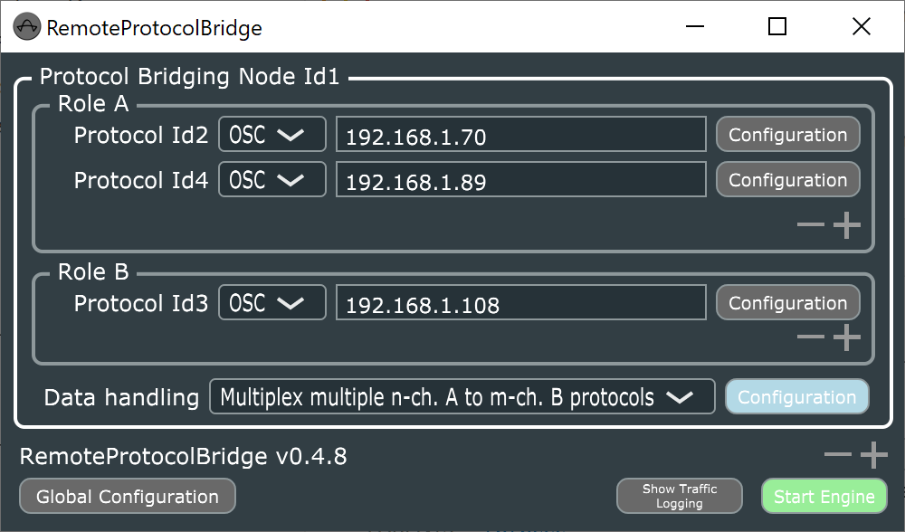
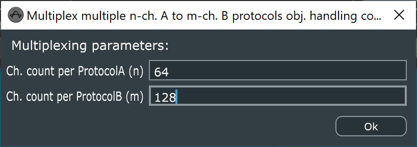

<a name ="dualDS100parallel" />

### **Using manual OSC failover with two DS100**
By choosing the Data handling "A1 forwarding only (val. changes only)" and switching to the complementary "A2 forwarding only (val. changes only)" in a failover situation, d&b Software bridge can be used to control two DS100 in parallel and use only the data received by polling from one of the DS100. This way, in case the main DS100 fails, switching to the backup DS100 regarding updating data values in the Console can be achieved.
* Add a second DS100 connection by clicking the "+" in **Role A** protocol groupbox.
* Enter the IP address of the second DS100 in the text field. The IP address of the DS100 can be obtained from the «Info» tab in the «Device» view in R1 V3.
* Open the OSC protocol configuration communication settings window for the second DS100 by clicking the "Configuration" button of the just added second Role A the protocol. 
* Enter the Listening port and the Remote port in the two text fields. (the Remote port is the listening port of the DS100 = 50010; the Listening port is the reply port of the DS100 = 50011).
* Enable the following parameters by checking the "enable" checkbox to the right of the parameter description (this enables them for polling).
  * Sound Object Position X
  * Sound Object Position Y
  * Sound Object Spread
  * Sound Object Delay Mode
  * Sound Object Send Gain
* Enter the channels you want to control by defining a range "1-16" or multiple channel numbers divided by commas "1, 2, 3, 7, 8, 9" as well as mapping areas. **These channels must be identical inbetween configurations of both DS100 configured in Role A**
* Click "Ok" to close the communication settings window.
* Select "A1 forwarding only (val. changes only)" from the Data handling dropdown to achive that all data that is received from DS100 through polling and that contains changed data values is forwarded to Console.
* Click the "Configuration" button for Data handling module and select "0.001" as sensibility for value change detection.
* When the system is running and a situation arises that requires switching from main to backup DS100, select "A2 forwarding only (val. changes only)" while the Software bridge is running.

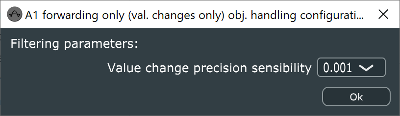

<a name="additionalFunctionality" />

## **Additional functionality**

### **Protocol Traffic Logging**
The Software bridge can log and display the network traffic handled.

This function is intended to simplify error analysis.

**Note:** This function may require a lot of computer resources and lead to a high processor load on the PC.
At the same time, activating this function will lead to a considerable amount of accumulated data in a very short time.
For this reason, only use this function for troubleshooting not for normal operation since it will endanger the stability of your PC and the software.

* Open the General configuration window by clicking on the Global Configuaration button.
* Tick the checkbox next to Allow protocol logging window.
* After closing the General configuration window, a “Show Traffic Logging” button is available.
* Clicking the Show Traffic Logging button opens the Protocol Traffic Logging window.
* The dropdown in the lower left corner allows toggeling between a traffic plot and a message log.
* Clicking the "Close" button closes the window.

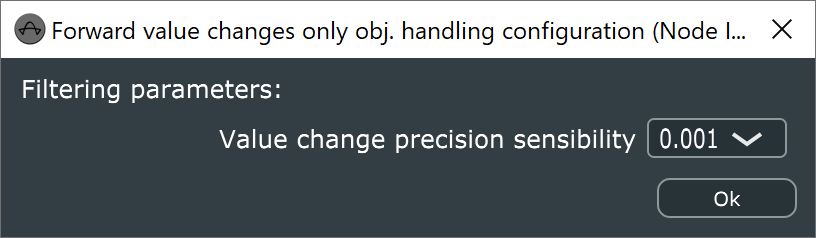

