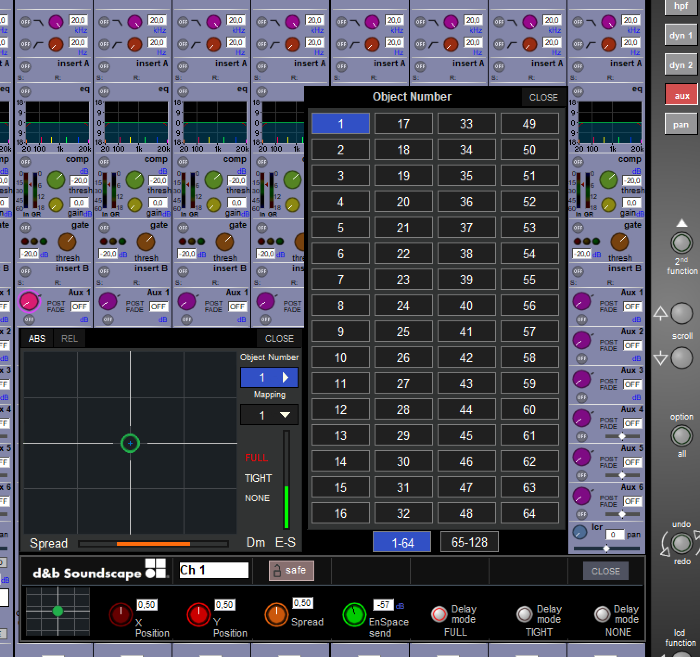

# **DiGiCo console control for d&b Soundscape**

Copyright (C) 2017-2022, d&b audiotechnik GmbH & Co. KG

By downloading software from this site, you agree to the terms and conditions described in the [End-User License Agreement](EULA.md). If you do not agree with such terms and conditions do not download the software.

## Latest binaries can be downloaded here: [LATEST RELEASE](../../releases/latest)

---

<a name="toc" />

## **Table of contents**

* [1. Introduction](#introduction)
* [2. Features](#features)
* [3. Requirements](#requirements)
* [4. Setting up DiGiCo console control for d&b Soundscape (stand alone)](#setupDigico)
* [5. Enabling bidirectional communication for d&b Soundscape channel control using RemoteProtocolBridge](#setupDigicoWithPollingBridge)
* [6. Advanced Functions](#advancedFunctions)
  * [Using 128 console channels to control two DS100s](#128chCascade)
  * [Using manual failover with two DS100](#dualDS100parallel)
* [7. Additional functionality](#additionalFunctionality)

<a name="introduction" />

## **1. Introduction**

d&b Soundscape integration for all DiGiCo SD and Quantum consoles can be achieved with a dedicated d&b Soundscape interface and the RemoteProtocolBridge software for optional bidirectional communication 
provided by d&b.

Object-based functions of d&b Soundscape are added to the DiGiCo workflow, from object control in the channel strip up to the scene memory of the consoles.

A detailed description of the d&b Soundscape system, and documentation of the functions, features and configuration options are given in the "TI 501 d&b Soundscape, System design and operation" which is available for download from the d&b website at www.dbaudio.com.

For more info about the d&b Soundscape system and concept, please visit: www.dbaudio.com and www.dbsoundscape.com.

More information about DiGiCo consoles and the OSC implementation is provided on www.digico.biz or from the DiGiCo Support team.

<a name="features" />

## **2. Features**

### **Parameters controllable by the DiGiCo console integration**
* En-Scene X & Y position (relative to a coordinate mapping)
* En-Scene Spread
* En-Scene Delay mode
* En-Space (reverb) send level

### **Features and functions of this dedicated integration**
* Free assignment of the controlled object per console 
channel strip
* Free assignment of positioning / mapping area per 
channel strip
* Up to 128 objects controllable from one console (more 
than 64 objects require 2x DS100 and 
RemoteProtocolBridge)
* All parameters including the assignment of objects and 
mapping areas can be stored and recalled using the 
regular scene memory of the console
* Dedicated on-screen GUI representing all parameter 
values and enabling objects positioning via the 
console's touch screen
* Configuration online and via the DiGiCo offline software

<a name="requirements" />

## **3. Requirements**

* A DiGiCo SDxx or Quantum console with software application V1528 or higher.
* A d&b DS100 Signal Engine with active En-Scene and / or En-Space license. It is recommended to use thelatest firmware available (please check online using theService view in the d&b R1 software).
* Console and DS100 Signal Engine connected to the same physical network and with IP addresses in the same subnet (to establish OSC communication).
* For configuration and monitoring of the DS100: A Windows or mac OS computer running d&b ArrayCalc and d&b R1.
* For bidirectional communication / workflow: Win or mac OS computer running RemoteProtocolBridge. This computer must be connected to the same network.On Windows operating systems, RemoteProtocolBridge requires installing the Visual C++ Redistributable Packages for Visual Studio 2017. For further details, see https://go.microsoft.com/fwlink/?LinkId=746572.
* Please note that when using RemoteProtocolBridge, no other OSC application should be run simultaneously on the same machine. As all OSC applications access the same port, this would lead to conflicts.

<a name="setupDigico" />

## **4. Setting up DiGiCo console control for d&b Soundscape (stand alone)**

### **Setting up d&b Soundscape channel control on a DiGiCo SD-series console**

On the Master screen, select “Setup” and go to “External Control”.

### **Switch on External Control and select the correct mode for d&b Soundscape control**
* Switch Enable External Control to “YES”.
* Switch on “Suppress OSC retransmit” to prevent the console from replying to every incoming OSC message
* Switch on “Recall with session” if loading a session shall trigger the console to send all OSC messages initially.
* Select add **device > other osc**

### **Parameters to establish the connection with the DS100**
* Enter a name of your choice.
* Enter the IP address of the DS100. The IP address of the DS100 can be obtained from the «Info» tab in the «Devices» view in R1 V3.
* Enter 50010 as the Send port (this is the port the DS100 listens to).
* Enter 50011 as the Receive port of the DS100 (this is the port the DS100 replies to).
* Press the “OK”/ return key.
* Click the red cross in the Enabled column to the right of your entries (a green check mark will appear instead).

### **Enabling the External Control window for a channel strip of the console**

#### **Channel surface**
On any Input or Group channel strip
* Open the Channel Outputs window by clicking the bottom section of the channel strip.
* Switch on d&b Control and click View.
* Returning to a standard Input channel strip view, you will see that the standard panner has changed appearance to show the new d&b Soundscape controls.

#### **External Control window**
* Touch the new control in the channel strip to bring up an expanded view of the d&b Soundscape control which allows the parameters to be adjusted with the switches and rotary encoders under the touch screen.
* Functions (from left to right)
  * x/y position display
  * Sound Object x Position (rotary)
  * Sound Object y Position (rotary)
  * Sound Object Spread factor (rotary)
  * Sound Object En-Space Send Gain (rotary)
  * Sound Object Delay Mode (toggle buttons)
* Touch the small x/y position display in the expanded view to further expand the display.
  * Click on the Object Number button to select which sound object that the channel strip shall control.
  * Click on the Mapping button to select which mapping area shall be targeted from the channel strip's controls.

<a name="setupDigicoWithPollingBridge" />

## **5. Enabling bidirectional communication for d&b Soundscape channel control using RemoteProtocolBridge**

### **General**
The OSC protocol specification does not define how valuechanges in a controlled device are kept in sync with what an external controller displays.

To keep in sync with possible parameter value changes in the controlled device, the OSC controller has to actively read these values from the controlled device at a sufficiently short refresh interval (so-called OSC 'polling' functionality. Polling device data is not available in DiGiCo d&b Soundscape control.

For bidirectional communication between DiGiCo consoles and DS100, a separate software bridge ('RemoteProtocolBridge') that polls Soundscape object parameters and transmits them back to the console is required and available from d&b.

Therefore, the setup within the console is different than in stand-alone operation with a DS100.

This provides a workflow in which d&b Soundscape can be operated by a console, the d&b R1 Remote control software and other controllers simultaneously with the console always displaying the current parameter values ofthe DS100.

### **Different data-flow for bidirectional communication with RemoteProtocolBridge**
When using RemoteProtocolBridge, the console does not communicate with the DS100 directly anymore. Rather, the console's target is the software bridge which passes onthe console's commands to the DS100 while also polling parameter values from the DS100 and passing them back to the console.

### **Console parameters to establish the connection of the console with RemoteProtocolBridge**
Ensure the console, the PC running RemoteProtocolBridge and the DS100 are connected to the same Ethernet network and their IP addresses and subnet masks are compatible.

Click the “add device” button, select “other OSC” from the drop-down list and enter the values as described below to establish the connection.

* Enter a name of your choice.
* Enter the IP address of the computer running RemoteProtocolBridge.
* Enter the Send port of the software (e.g. 50013, do not use 50010 and 50011).
* Enter the Receive port of the software (e.g. 50012, do not use 50010 and 50011).
* Press the “OK”/ return key.

Click the red cross in the Enabled column to the right of 
your entries (a green check mark will appear instead).

 ### **RemoteProtocolBridge parameters to establish the connection from the console to the DS100**
Ensure the console, the computer running RemoteProtocolBridge and the DS100 are connected to the same Ethernet network and their IP addresses and subnet masks are compatible.

When using RemoteProtocolBridge, no other OSC application should be run simultaneously on the same machine. As all OSC applications access the same port, this would lead to conflicts.

**Please note** that RemoteProtocolBridge can only handle 
the following d&b Soundscape object parameters:

Position, Spread, Delay Mode, En-Space Send Gain.

### **Connection to the DS100**
**Role A** within RemoteProtocolBridge refers to the DS100. 
* Enter the IP address of the DS100 in the text field. The IP address of the DS100 can be obtained from the «Info» tab in the «Device» view in R1 V3, e.g. 192.168.1.70.

* Click the Role A 'Configuration' button to open its OSC 
protocol configuration settings.
* Enter the Listening port and the Remote port.

  The Remote port is the listening port of the DS100 = 50010.

  The Listening port is the reply port of the DS100 = 50011.

* Enable the following parameters for polling via the 'enable' checkboxes:
  * Sound Object Position X
  * Sound Object Position Y
  * Sound Object Spread
  * Sound Object Delay Mode
  * En-Space Send Gain
* Enter the channels you want to control by defining a 
range (e.g. “1-16”) or by a comma-separated list of 
individual channels (e.g. “1,2,3,7,9,11”).
* Define the Mapping Areas to be used by checking the corresponding boxes under 'Mapping'. All Mapping Areas used by the respective channels on the console must be enable here.
* If desired, change the polling interval from the the default value of 100ms.
* Finish the configuration by clicking 'OK' in the General 
configuration window.

### **Connection to the Console**
**Role B** within RemoteProtocolBridge refers to the console.
* Enter the IP address of the console in the first field. In this example, it's 192.168.1.108.
* Click the Role B 'Configuration' button to open its OSC protocol configuration settings.
* Enter the Listening and Remote ports as used when setting up the console, e.g. 50012 and 50013 as suggested below. Do not use the ports assigned to the DS100.
* **DO NOT** enable any objects for polling.

### **Sound object data Handling**
Select 'Forward value changes only' from the Data handling drop-down This determines data that has been received from the DS100 and that contains changed values is passed back to the console.

Click the 'Configuration' button in the Data handling section to set the value change detection threshold to '0.001' as shown below.

Start the bridge functionality by clicking “Start Engine”.

<a name="advancedFunctions" />

## **6. Advanced functions**

<a name="128chCascade" />

### **Using 128 console channels to control two DS100**
RemoteProtocolBridge can be used to control two DS100s from a single console to achieve a total maximum of 128 sound objects.

When using RemoteProtocolBridge, no other OSC application should be run simultaneously on the same machine. As all OSC applications access the same port, this would lead to conflicts.

* Add a second DS100 connection by clicking '+' int int Role A protocol groupbox.
* Enter the IP address of the second DS100 into the text field. The IP addressof the DS100 can be obtained from the 'Info' tab on the 'Devices' view in R1 V3.
* Click the 'Configuration' button for the newly added 
entry.
* Enter the Listening and Remote ports into the respective fields. Use 50010 for the Remote port (this is the port the DS100 listens on) and 50011 for the Listening port (this is the port the DS100 replies on).
* Enable the following parameters for polling by checking their box:
  * Sound Object Position X
  * Sound Object Position Y
  * Sound Object Spread
  * Sound Object Delay Mode
  * En-Space Send Gain
* Enter the channels you want to control by defining a range (e.g. “1-16”) or as a comma-separated list (e.g. “1,3,6,8,11”), as well as the respective mapping areas to be used. The mapping areas selected must conform to the mapping areas selected in the respective console channel strips.

  **Please note that the number range of 1-64 refers to the channels of the second DS100 and therefore to console channels 65-128!**
* Click 'OK' to close the dialog.
* In the Data Handling section, select 'Multiplex multiple n-ch. A to m-ch. B protocols” from the drop-down
* Click on 'Configuration' in the Data Handling section.
* Enter “64” for 'Ch. count per ProtocolA (n)' that corresponds to the two DS100 configured.
* Enter “128” for 'Ch. count per ProtocolB (m)' that corresponds to the console.
* Click 'OK' to close the configuration window.

<a name ="dualDS100parallel" />

### **Using manual failover with two DS100**
RemoteProtocolBridge can be used to control two DS100 in parallel, so that both receive exactly the same data andonly poll one unit to display its parameter values on the console's GUI.

In case of failure of one DS100, the DS100 whose values are polled can be switched to the other machine in RemoteProtocolBridge for continued operation.

When using RemoteProtocolBridge, no other OSC application should be run simultaneously on the same machine. As all OSC applications access the same port, this would lead to conflicts.

* Add a second DS100 by clicking '+' in the Role A 
group box.
* Enter the IP address of the second DS100 into the 
respective field. The IP address of the DS100 can be 
obtained via the 'Info' on the 'Devices' view in R1 V3.
* Click the 'Configuration' button for the newly added 
device.
* Enter the Listening and Remote ports into the respective
fields. Use 50010 for the Remote port (this is the port
the DS100 listens on) and 50011 for the Listening port
(this is the port the DS100 replies on).
* Enable the following parameters for polling by checking
their box:
  * Sound Object Position X
  * Sound Object Position Y
  * Sound Object Spread
  * Sound Object Delay Mode
  * En-Space Send Gain
* Enter the channels you want to control by defining a
range (e.g. “1-16”) or as a comma-separated list (e.g.
“1,3,6,8,11”), as well as the respective mapping areas
to be used. The mapping areas selected must conform
to the mapping areas selected in the respective console
channel strips. 

  **These settings must be identical to the ones
for the first DS100.**
* Click 'OK' to close the configuration window.
* Select 'A1 forwarding only (val. changes only)' from the
Data Handling drop-down This determines data that has
been received from the DS100 and that contains
changed values is passed back to the console.
* Click the 'Configuration' button in the Data handling
section to set the value change detection threshold to
'0.001' as shown below.
* When the system is running and a situation arises that
requires switching from one to the other DS100, select
'A2 forwarding only (val. changes only)' while
RemoteProtocolBridge is running.

<a name="additionalFunctionality" />

## **7. Additional functionality**

### **Protocol Traffic Logging**
RemoteProtocolBridge can log and display the handled network traffic. This function is intended to simplify error analysis.

**Note**

Activating this function will lead to high CPU load and considerable log file sizes in a very short time, which in turn may cause system instability. For this reason, it is recommended to only use it for troubleshooting and only for short periods of time.

* Click the 'General configuration' button to open the 
respective dialog window.
* Tick the checkbox next to 'Allow protocol logging 
window'.
* Click 'Show Traffic Logging' to open the logging 
window.
* The drop-down in the lower left corner toggles between 
the traffic log and a message log.
* Click 'Close' to close the window.

